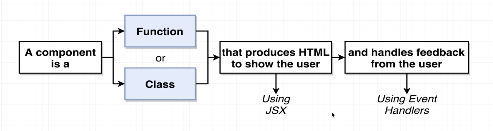
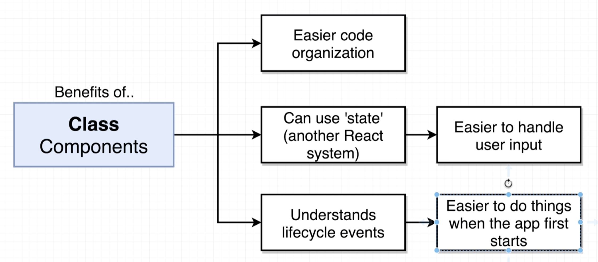
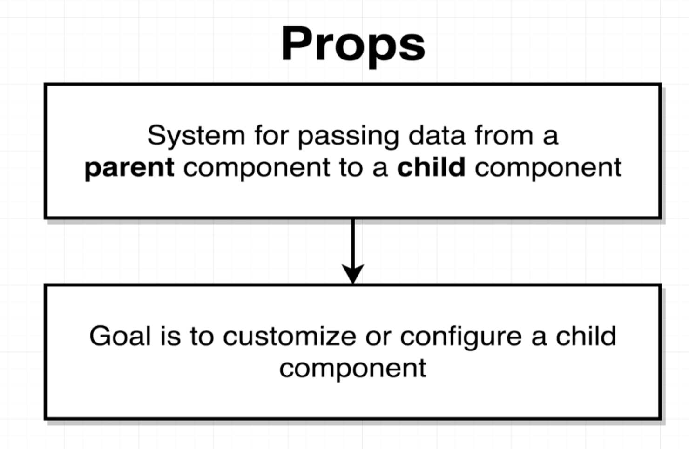
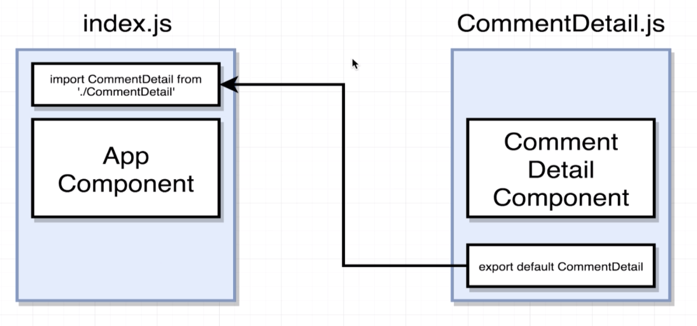
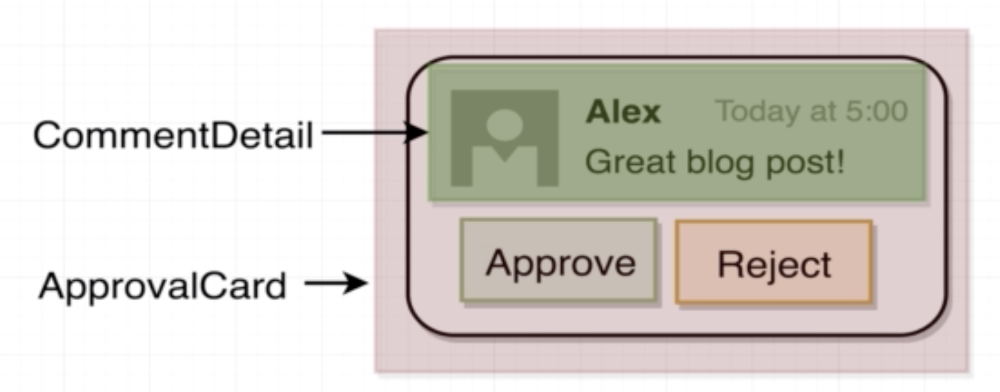
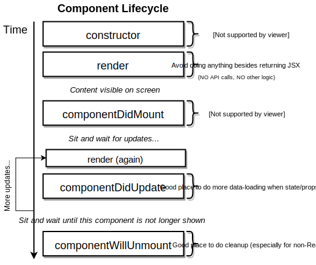

# React Cheatsheet

## Basic Javascript Concepts
##### What is Babel?
Babel is a transpiler that converts our js code in any modern version (e.g. ES2016, ES2017) to ES5, which is universally supported by browsers.  It also converts jsx to js.

##### How does JS import system work?
There are 2 module systems in JS: 
- JS ES2015 Modules use the `import` keyword. (this is the one we typically use)
- Common Modules use the `require` keyword.

##### How does the `import` keyword work?
- Explained through an example: `import React from 'react'` looks for the 'react' folder insite the `node_modules` and assigns all the code to the `React` variable in my file (I can name it whatever I want).
- We could also import from a path `import MyLibrary from 'a/path'`.

## Basic React Concepts
##### What is the difference between React and ReactDOM?
React is a library that contains how al components work.
ReactDOM is a library that deals with putting those components on the DOM.  If we were using React Native, then there would be a library to render the components inside the app.

##### What is a React Component?


##### Functional Components vs Class Based Components.
- _Use Functional Components_ for very simple content (e.g. only render HTML using some props passed to it).
- _Use Class Components_ for everything else (e.g. complex logic, handling user interaction).


##### What are Props in react and why do they exist?

Customization can be either to:
1) Customize how a component looks.
2) Customize how a user interacts with it.

Children cannot pass props to the parent (only parent to child). 

## Working on React Projects
##### Tooling: How do I start a new react project?
You can use the `create-react-app` command line tool.  You install it using `npm install -g create-react-app`.

##### What is the basic structure of a React project?
- src: where all the code goes (js and css).
    - There is a special file `index.js` which is the "root" of your react application.
- public: where static HTML and assets go.
- node_modules: all of the dependencies of the project (we never want to manually go inside it).
- package.json: analogous to the gemfile

##### How do I start the development server? 
`npm start`

##### Naming Conventions
- React component files are named using CamelCase. For example `CommentDetails.js` for the `CommentDetail` component. 

## Working with JSX
##### Differences between HTML and JSX
1. Custom inline styling
```html
<!-- HTML -->
<div style="background-color: red;"></div>
```
```jsx
// JSX - Note: 1) JS object for properties, 2) CamelCase for dashed properties.
// Outer curly braces represent JS interpolation, Inner {} represent a JS object
<div style={{backgroundColor: 'red'}}></div>
```

2. The HTML class in a tag `<label class="foo">...` turns into `<label className="foo">...`

3. Referencing JS variables in JSX
```jsx
const App = () => {
	const buttonText = 'Click Me!';
	return (
		<button>{buttonText}</button>
	);
}
```
We can use `{}`to interpolate any JS within JSX. The only limitation is: we __cannot__ use a JS object to print it out as text. For example, the next snippet will result in a _"Objects are not valid as a react child"_ error.
```jsx
// Wrong
const App = () => {
	const buttonText = {text: 'Click Me'};
	return (
		<button>{buttonText}</button>
	);
}

// Right
const App = () => {
	const buttonText = {text: 'Click Me'};
	return (
		<button>{buttonText.text}</button>
	);
}
```

4. There are other differences in property names like `<label for="foo">...` turns into `<label htmlFor="foo">`.  Many of these won't crash your app. As a general rule, if you see a _did you mean X_ warning message in the browser console, it is because you are using an invalid property name from React's point of view. 


## Working with React
##### Exporting and importing components


##### Passing and Receiving Props
Props can only be passed from the parent to a child (not the other way around).
```jsx harmony
// Passing: Just like custom HTML attributes
const App = () => {
    return (
        <div className="ui container comments">
            <CommentDetail author='Sam'  body='This is comment 1'  avatarUrl={faker.image.avatar()}/>
        </div>
    );
};
```

```jsx harmony
// Receiving: passed as an object as the first argument to the functional component.
const CommentDetail = (props) => {
    return (
        <div className="comment">
            <a className="avatar" href="/">
                
            </a>
            <div className="content">
                <a href="/" className="author">{props.author}</a>
                <div className="text">{props.body}</div>
            </div>
        </div>
    );
};
```

##### Injecting custom children to a component
We will use the following example to illustrate:

```jsx harmony
// index.js
// ApprovalCard gets injected the custom CommentDetail component
const App = () => {
    return (
        <div className="ui container comments">
            <ApprovalCard>
                <CommentDetail author='Sam' body='This is comment 1' avatarUrl={faker.image.avatar()}/>
            </ApprovalCard>
        </div>
    );
};
```

```jsx harmony
// ApprovalCard.js
// Injected children get assigned by react to props.chilren
const ApprovalCard = (props) => {
    return (
        <div className="ui card">
            <div className="content">{props.children}</div>
            {/*...*/}
        </div>
    );
};
```

##### Rules for creating Class Based components
Class based components must comply 3 rules:
1. Must be a JS Class
2. Must __extend__ React.Component
3. Must define a `render` method that returns some JSX. This method defines how the component renders itself.


##### Rules for the State System
1. Only usable with class components.

    1.1 Note: Now it can technically by used with functional components through the 'hooks' system.
2. You will confuse props with state.
3. 'State' is a JS object that contains data relevant to a singular component.
4. Updating 'state' on a component causes the component to (almost) instantly rerender.
5. State must be initialized when a component is created. This can be done in 2 equivalent ways (They are equivalent
once Babel transpiles the code.) 
```jsx harmony
// Option 1: Explicitly initialize inside the constructor method
class App extends React.Component {
    // The constructor takes props as an argument
    constructor(props) {
        super(props); // We always have to call super inside the constructor
        // This is the ONLY time we directly assign this.state (for any other time use setState)
        this.state = { lat: null };
    }
    // ...
}

// Option 2: Use shorthand class property initialization
class App extends React.Component {
     state = { lat: null };
    // ...
}
```

6. State can __only__ be updated using the function `setState`.
```jsx harmony
class App extends React.Component {
    myFunction() {
        myAsyncFunction(
            // On Success
            (myArg) => {
                // We use setState, NOT this.state.lat = ....
                this.setState({ lat: myArg})
            },
            // On Failure
            (err) => console.log(err)
        );
    }
}
```

##### Anti-Pattern: Place API calls or heavy logic inside the `render` method
The `render` method is called by React VERY frequently.  If we put any API calls or heavy logic inside it, we might
be doing unnecessary extra work.

##### Handling Errors Gracefully
Using a `errorMessage` property inside the component's state is a simple and nice way to handle errors.  For this
we also need to define how the component renders when the `errorMessage` property is present. Here is a simple example
(note there are more elegant ways to do the conditional rendering):
```jsx harmony
class App extends React.Component {
    
    constructor(props) {
        super(props);
        this.state = { lat: null, errorMessage: '' };
    }
    // ...
    render() {
        if (this.state.errorMessage && !this.state.lat) {
            return <div>Error: {this.state.errorMessage}</div>
        }
        if (!this.state.errorMessage && this.state.lat) {
            return <div>Latitude: {this.state.lat}</div>
        }
        return <div>Loading...</div>
    }
}
```

##### Class Components'Lifecycle methods

- `constructor`: when the component is instantiated.
- `render`: compulsory to define it.
- `componentDidMount`: called ONE time when the component first shows on the screen.
- Updates are caused by changes in state through the `setState` method.
- `componentDidUpdate`: called every time the component gets updated.  It is called AFTER `render` when the state changes.  
- `componentWillUnmount`: called when the component is going to be removed from the screen. Typically used for cleanup.

##### A Test
break cache?

