# React Cheatsheet

## Basic Javascript Concepts
##### What is Babel?
Babel is a transpiler that converts our js code in any modern version (e.g. ES2016, ES2017) to ES5, which is universally supported by browsers.  It also converts jsx to js.

##### How does JS import system work?
There are 2 module systems in JS: 
- JS ES2015 Modules use the `import` keyword. (this is the one we typically use)
- Common Modules use the `require` keyword.

##### How does the `import` keyword work?
- Explained through an example: `import React from 'react'` looks for the 'react' folder insite the `node_modules` and assigns all the code to the `React` variable in my file (I can name it whatever I want).
- We could also import from a path `import MyLibrary from 'a/path'`.

## Basic React Concepts
##### What is the difference between React and ReactDOM?
React is a library that contains how al components work.
ReactDOM is a library that deals with putting those components on the DOM.  If we were using React Native, then there would be a library to render the components inside the app.

##### What is a React Component?


##### Functional Components vs Class Based Components.
- _Use Functional Components_ for very simple content (e.g. only render HTML using some props passed to it).
- _Use Class Components_ for everything else (e.g. complex logic, handling any user interaction).


##### What are Props in react and why do they exist?

Customization can be either to:
1) Customize how a component looks.
2) Customize how a user interacts with it.

Children cannot pass props to the parent (only parent to child). 

## Working on React Projects
##### Tooling: How do I start a new react project?
You can use the `create-react-app` command line tool.  You install it using `npm install -g create-react-app`.

##### What is the basic structure of a React project?
- src: where all the code goes (js and css).
    - There is a special file `index.js` which is the "root" of your react application.
- public: where static HTML and assets go.
- node_modules: all of the dependencies of the project (we never want to manually go inside it).
- package.json: analogous to the gemfile

##### How do I start the development server? 
`npm start`

##### Naming Conventions
- React component files are named using CamelCase. For example `CommentDetails.js` for the `CommentDetail` component. 

## Working with JSX
##### Differences between HTML and JSX
1. Custom inline styling
```html
<!-- HTML -->
<div style="background-color: red;"></div>
```
```jsx
// JSX - Note: 1) JS object for properties, 2) CamelCase for dashed properties.
// Outer curly braces represent JS interpolation, Inner {} represent a JS object
<div style={{backgroundColor: 'red'}}></div>
```

2. The HTML class in a tag `<label class="foo">...` turns into `<label className="foo">...`

3. Referencing JS variables in JSX
```jsx
const App = () => {
	const buttonText = 'Click Me!';
	return (
		<button>{buttonText}</button>
	);
}
```
We can use `{}`to interpolate any JS within JSX. The only limitation is: we __cannot__ use a JS object to print it out as text. For example, the next snippet will result in a _"Objects are not valid as a react child"_ error.
```jsx
// Wrong
const App = () => {
	const buttonText = {text: 'Click Me'};
	return (
		<button>{buttonText}</button>
	);
}

// Right
const App = () => {
	const buttonText = {text: 'Click Me'};
	return (
		<button>{buttonText.text}</button>
	);
}
```

4. There are other differences in property names like `<label for="foo">...` turns into `<label htmlFor="foo">`.  Many of these won't crash your app. As a general rule, if you see a _did you mean X_ warning message in the browser console, it is because you are using an invalid property name from React's point of view. 


## Working with React
##### Exporting and importing components


##### Passing and Receiving Props
Props can only be passed from the parent to a child (not the other way around).
```jsx harmony
// Passing: Just like custom HTML attributes
const App = () => {
    return (
        <div className="ui container comments">
            <CommentDetail author='Sam'  body='This is comment 1'  avatarUrl={faker.image.avatar()}/>
        </div>
    );
};
```

```jsx harmony
// Receiving props in functional components: passed as an object as the first argument.
const CommentDetail = (props) => {
    return (
        <div className="comment">
            <a className="avatar" href="/">
                
            </a>
            <div className="content">
                <a href="/" className="author">{props.author}</a>
                <div className="text">{props.body}</div>
            </div>
        </div>
    );
};

// Receiving props in class based component: added to a property this.props
class CommentDetail extends React.Component {
    someFunction() {
        console.log(this.props.author);
    }
}
```

##### Injecting custom children to a component
We will use the following example to illustrate:

```jsx harmony
// index.js
// ApprovalCard gets injected the custom CommentDetail component
const App = () => {
    return (
        <div className="ui container comments">
            <ApprovalCard>
                <CommentDetail author='Sam' body='This is comment 1' avatarUrl={faker.image.avatar()}/>
            </ApprovalCard>
        </div>
    );
};
```

```jsx harmony
// ApprovalCard.js
// Injected children get assigned by react to props.chilren
const ApprovalCard = (props) => {
    return (
        <div className="ui card">
            <div className="content">{props.children}</div>
            {/*...*/}
        </div>
    );
};
```

##### Rules for creating Class Based components
Class based components must comply 3 rules:
1. Must be a JS Class
2. Must __extend__ React.Component
3. Must define a `render` method that returns some JSX. This method defines how the component renders itself.


##### Rules for the State System
1. Only usable with class components.

    1.1 Note: Now it can technically by used with functional components through the 'hooks' system.
2. You will confuse props with state.
3. 'State' is a JS object that contains data relevant to a singular component.
4. Updating 'state' on a component causes the component to (almost) instantly re-render. Re-rendering also triggers the re-rendering of ALL CHILD components.
5. State must be initialized when a component is created. This can be done in 2 equivalent ways (They are equivalent
once Babel transpiles the code.) 
```jsx harmony
// Option 1: Explicitly initialize inside the constructor method
class App extends React.Component {
    // The constructor takes props as an argument
    constructor(props) {
        super(props); // We always have to call super inside the constructor
        // This is the ONLY time we directly assign this.state (for any other time use setState)
        this.state = { lat: null };
    }
    // ...
}

// Option 2: Use shorthand class property initialization
class App extends React.Component {
     state = { lat: null };
    // ...
}
```

6. State can __only__ be updated using the function `setState`.
```jsx harmony
class App extends React.Component {
    myFunction() {
        myAsyncFunction(
            // On Success
            (myArg) => {
                // We use setState, NOT this.state.lat = ....
                this.setState({ lat: myArg})
            },
            // On Failure
            (err) => console.log(err)
        );
    }
}
```

##### Anti-Pattern: Place API calls or heavy logic inside the `render` method
The `render` method is called by React VERY frequently.  If we put any API calls or heavy logic inside it, we might
be doing unnecessary extra work.

##### Handling Errors Gracefully
Using a `errorMessage` property inside the component's state is a simple and nice way to handle errors.  For this
we also need to define how the component renders when the `errorMessage` property is present. Here is a simple example
(note there are more elegant ways to do the conditional rendering):
```jsx harmony
class App extends React.Component {
    
    constructor(props) {
        super(props);
        this.state = { lat: null, errorMessage: '' };
    }
    // ...
    render() {
        if (this.state.errorMessage && !this.state.lat) {
            return <div>Error: {this.state.errorMessage}</div>
        }
        if (!this.state.errorMessage && this.state.lat) {
            return <div>Latitude: {this.state.lat}</div>
        }
        return <div>Loading...</div>
    }
}
```

##### Class Components'Lifecycle methods

- `constructor`: when the component is instantiated.
- `render`: compulsory to define it.
- `componentDidMount`: called ONE time when the component first shows on the screen.
- Updates are caused by changes in state through the `setState` method.
- `componentDidUpdate`: called every time the component gets updated.  It is called AFTER `render` when the state changes.  
- `componentWillUnmount`: called when the component is going to be removed from the screen. Typically used for cleanup.

##### Pattern: Use configuration objects for conditional rendering
When we need to get some text, class names (etc) based on a condition, configuration objects are a better alternative
than `if..else` statements.  See example:
```jsx harmony
//  This is the configuration object
const seasonConfig = {
    summer: {
        text: 'Let\'s hit the Beach',
        iconName: 'sun'
    },
    winter: {
        text: 'Burr, it is chilly',
        iconName: 'snowflake'
    }
};
// ...
const SeasonDisplay = (props) => {
    const season = getSeason(props.lat, new Date().getMonth()); // returns either 'summer' or 'winter'
    const {text, iconName} = seasonConfig[season]; // Destructurizing a JS object
    return (
        <div>
            <i className={`icon ${iconName}`} />
            <h1>{text}</h1>
            <i className={`icon ${iconName}`} />
        </div>
    );
};
```

##### Pattern: Creating Component-Specific CSS
A common pattern is to create a dedicated stylesheet for each component which is in charge of defining the styles 
of the component.  For example, for the `SeasonDisplay.js`, we create a `SeasonDisplay.css`.

Inside the `SeasonDisplay.js` we:
- `import SeasonDisplay.css` and Babel will make that the stylesheet gets correctly imported in the HTML.
- Add a matching `season-display` class to the root of the returned JSX so that we can specifically target elements
inside that component.

Example:
```jsx harmony
// SeasonDisplay.js
import './SeasonDisplay.css';

const SeasonDisplay = (props) => {
    // ...
    return (
        // Note the season-display class
        <div className={`season-display ${season}`}>
            {/* ... */}
        </div>
    );
};
```

```css
.season-display {
    display: flex;
    justify-content: center;
}

.season-display.winter i {
    color: blue;
}

.season-display.summer i {
    color: red;
}
```
##### Default props
Default props are used when we want a component to have a props with a default value in case the parent component
does not specify a particular prop.
```jsx harmony
const Spinner = (props) => {
    return(
        <div className="ui active dimmer">
            <div className="ui big text loader">{props.message}</div>
        </div>
    );
};

// Default Props is a JS object in the main body of the Spinner.js file
Spinner.defaultProps = {
    message: 'Loading...'
};
```

##### Pattern: Clean Conditional Rendering Through Helper Methods
As a general rule, we want to avoid having more than ONE return in the `render` method or having any heavy logic in it.
To avoid this, we can create custom _helper methods_ that abstract better the conditional logic.
```jsx harmony
class App extends React.Component {
    //...
    // This is a helper method that unloads the conditional logic from the render method
    renderContent() {
        if (this.state.errorMessage && !this.state.lat) {
            return <div>Error: {this.state.errorMessage}</div>;
        }
        if (!this.state.errorMessage && this.state.lat) {
            return <SeasonDisplay lat={this.state.lat} />
        }
        return <Spinner message = 'Determining your Location...'/>;
    }

    render() {
        return (
            <div className="some-class-that-is-always-needed">
                {this.renderContent()}
            </div>
        );
    }
}
```
##### Handling User Interaction With Event Handlers
We can detect user interaction through special props like `onChange`.  It is our job
to define a **callback function** that will handle the event with any custom logic we need.

The most used special properties are:
- `onClick`: any HTML element can be wired up with `onClick`.
- `onChange`: triggered when a user changes an input.  Only input fields trigger `onChange`.
- `onSubmit`: only forms trigger `onSubmit`.

Here is an example for handling `onChange` on a Search Bar.
```jsx harmony
class SearchBar extends React.Component {
    // Used as a callback function to handle the change
    // "event" is passed by default to all event handlers
    onInputChange(event) {
        // Whatever logic I need
        console.log(event.target.value);
    }

    render() {
        return (
            <form>
                <label>Image Search</label>
                {/* onChange is a special property name that gets triggered when the input changes. */}
                {/* We provide the callback function to handle the change */}
                {/* Note that this example shows an uncontrolled element for simplicity. We prefer controlled elements */}
                <input type="text" onChange={this.onInputChange}/>
                
                {/* An alternative frequently used syntax is using arrow functions when the handlers are small */}
                <input type="text" onChange={ (e) => console.log(e.target.value) }/>
            </form>
        );
    }
}
```
##### Controlled vs Uncontrolled Elements
Depending on how we wire up them, HTML input elements can be classified as **controlled** or **uncontrolled**.

Uncontrolled elements are elements in which the "truth" of the data is sitting inside the HTML. In the following 
example, if we wanted to find the text in the input field from an arbitrary point in the component (e.g. from 
`componentDidUpdate`), we have no choice but to reach out to the HTML input element and read the value.

```jsx harmony
class SearchBar extends React.Component {
    onInputChange(event) { /* Whatever logic I need  */ }
    
    componentDidUpdate() {
        // To find out the search term, we have no option but to reach out to the HTML input.
    } 

    render() {
        return (
            <form>
                <label>Image Search</label>
                <input type="text" onChange={this.onInputChange}/>
            </form>
        );
    }
}
```

If we wire things differently we can make sure that the JS Component contains all the data and drives the HTML
(not the other way around).  __We always prefer controlled elements__. 
```jsx harmony
class SearchBar extends React.Component {
    // We use component state to store the search term.  In this way, we can reach for the state
    // at any arbitrary point to figure out the term.
    state = { term: ''};

    render() {
        return (
            <form className="ui form">
                <label>Image Search</label>
                {/* We fix (control) the value of the input through the state to make sure that */}
                {/* react DRIVES the HTML and not the other way around */}
                <input
                    type="text"
                    value={this.state.term}
                    onChange={ (e) => this.setState({term: e.target.value}) } />
            </form>
        );
    }
}
```

##### Common Error: TypeError: Cannot read property 'state' of undefined / How `this` works in Javascript

Note: this is a complex issue, to get a full understanding of the problem, re-watch videos __"84. Understanding 'this'
in Javascript"__ and __"85. Solving Context Issues"__ from Stephen Grider's Udemy course. 

The error is caused by how the context system works in JS (i.e. what value is assigned to `this` at runtime).

The next code exemplifies the problem:
```jsx harmony
class SearchBar extends React.Component {
    state = { term: ''};

    render() {
        return (
            /* Here we 'rip out' onFormSubmit from the SearchBar instance and give it to `onSubmit` */
            <form className="ui form" onSubmit={ this.onFormSubmit }>
                    <label>Image Search</label>
                    <input
                        type="text"
                        value={this.state.term}
                        onChange={ (e) => this.setState({term: e.target.value}) } />
            </form>
        );
    }
    
    onFormSubmit(event) {
            event.preventDefault();
            // Here `this` causes the problem because the function is called outside the scope of the
            // SearchBar instance.  In that context `this = undefined`.
            console.log(this.state.term);
        }
}
``` 
_Rule of thumb: the value of `this` inside a JS function_

`this` inside a function takes the value of the instance on which the function is being called
(i.e. what is left of the dot). For example, given an arbitrary function `myFun` that contains `this` inside it.
```js
myCar.myFun(); // `this` refers to the myCar instance
myTruck.myFun(); // `this` refers to the myTruck instance
myFun2 = myCar.myFun; // Rip out myFun and assign it to myFun2.
myFun2(); //`this` refers to `undefined` since myFun2 is not being called on any instance.
```  

_Solutions to the `this` context problem_
There are many solutions to this problem, we name the most popular.


- Solution 1: Fix the value of `this` inside the problematic function by binding it inside the `constructor`
```js
class SearchBar extends React.Component {
    state = { term: ''};
    
    constructor(props) {
        super(props);
        // Bind returns a new version of the function with the `this` keyword fixed to the current SearchBar instance.
        this.onFormSubmit = this.onFormSubmit.bind(this);
   }

    render() {
        return (
            <form className="ui form" onSubmit={ this.onFormSubmit }>
                    <label>Image Search</label>
                    <input
                        type="text"
                        value={this.state.term}
                        onChange={ (e) => this.setState({term: e.target.value}) } />
            </form>
        );
    }
    
    onFormSubmit(event) {
            event.preventDefault();
            // Once binded, `this` will always refer to the SearchBar instance 
            // (i.e. it is no longer context dependent).
            console.log(this.state.term);
        }
}
```

- Solution 2: Use ES6 arrow functions to declare instance methods. 
Arrow functions automatically bind the value of `this`. This is the most common method.
```jsx harmony
class SearchBar extends React.Component {
    state = { term: ''};

    render() {
        return (
            <form className="ui form" onSubmit={ this.onFormSubmit }>
                    <label>Image Search</label>
                    <input
                        type="text"
                        value={this.state.term}
                        onChange={ (e) => this.setState({term: e.target.value}) } />
            </form>
        );
    }
    
    onFormSubmit = (event) => {
        event.preventDefault();
        // Here `this` would cause the problem.  However, arrow functions automatically bind this to the instance.
        console.log(this.state.term);
    };
}
```

- Solution 3: Wrap callback inside an arrow function (that automatically binds `this`).
```jsx harmony
class SearchBar extends React.Component {
    state = { term: ''};

    render() {
        return (
            // Wrapping the callback with an arrow function automatically binds `this`
            <form className="ui form" onSubmit={ (e) => this.onFormSubmit(e) }>
                    <label>Image Search</label>
                    <input
                        type="text"
                        value={this.state.term}
                        onChange={ (e) => this.setState({term: e.target.value}) } />
            </form>
        );
    }
    
    onFormSubmit(event) {
            event.preventDefault();
            console.log(this.state.term);
        }
}
```

##### Communicating from Child to Parent through callbacks
By design, React only allows data to be pushed DOWN from parents to children through the props system.  If we want to communicate from a child to a parent, the parent needs to provide a callback function and the child will hold it as a prop to use it when necessary.

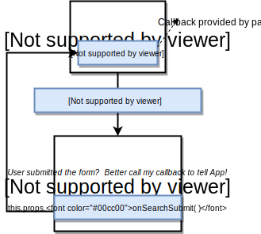

```jsx harmony
// Parent
class App extends React.Component {
    
    // The callback function for communication
    onSearchSubmit = (term) => {
        console.log(`From app: ${term}`);
    };

    render() {
        return  (
            <div className="ui container" style={{marginTop: '10px'}}>
	        {/* Pass down callback function as prop */}
                <SearchBar onSearchSubmit={this.onSearchSubmit}/>
            </div>
        );
    }
}

// Child
class SearchBar extends React.Component {
    state = { term: ''};

    onFormSubmit = (event) => {
        event.preventDefault();
        // Use Callback function to notify parent
        this.props.onSearchSubmit(this.state.term);
    };
}
```

### Making API requests with react
React itself does NOT do network requests.  For this we need to use an external library like `axios` or
the built-in function `fetch`.

#### Axios vs Fetch
- `fetch` is a built-in function to do network requests that does not add any overhead. However, it is very basic
and requires coding some boilerplate code.
- `axios` is a higher level 3rd party library that handles requests in a very predictable way.  Axios is recommended
to perform the API requests on react apps.
    - `npm install --save axios`  
    
#### Working with JS Promises
A promise is an object that represents the eventual completion or failure of an asynchronous operation.  Promises are
frequently used in JS for network requests and it is up to the developers to code what should happen when the
promise succeeds or fails.

In the context of API requests, there are 2 options for handling promises: 1) `promise.then`, 2) `async`, `await`

Note: more information can be found on video _"92. Handling Requests with Async Await"_ from Stephen Grider's course.

##### Option 1: Using `promise.then()`
The `then` method allows us to give the promise a callback to execute once the promise succeeds.
```jsx harmony
class App extends React.Component {

    // Callback for making a network request when the search term changes.
    onSearchSubmit = (term) => {
        axios.get('https://api.unsplash.com/search/photos', {
            params: { query: term},
            headers: {
                Authorization: 'Client-ID someRandomToken'
            }
        }).then((response)=>{
            // axios.get is async and returns a promise, so deal with it with `then` callback
            console.log(response.data.results);
            // Do whatever you need to do...
        })
    };

    render() { /*...*/ }
}
```

##### Option 2: Using `async` and `await`
This is a newer syntax that allows us to write simpler and cleaner code.
```jsx harmony
class App extends React.Component {

    // Callback for making a network request when the search term changes.
    // The network request is asynchronous, so we tag our function as `async` and
    // `await` to allow the promise to resolve
     onSearchSubmit = async (term) => {
         // axios.get is async and returns a promise, so we need to deal with the promise.
         const response = await axios.get('https://api.unsplash.com/search/photos', {
            params: { query: term},
            headers: {
                Authorization: 'Client-ID someRandomToken'
            }
        });
        this.setState({images: response.data.results});
    };

    render() { /*...*/ }
}
```
#### Creating Custom API Clients with axios
With axios, we can create a dedicated client that is configured to make requests with whatever configuration we 
set it up. This allows us to extract all the configuration, and authentication logic for a particular service
into a dedicated file.

For example, for communicating with the unsplash API we could:
```jsx harmony
// 1. Create a file in src/api/unsplash.js that will hold the dedicated unsplash client
import axios from 'axios';

export default axios.create({
    baseURL: 'https://api.unsplash.com',
    headers: {
        Authorization: 'Client-ID someRandomToken'
    }
});

// 2. Then we only use this pre-configured client in all other places we need to communicate with unsplash
import unsplash from "../api/unsplash";

class App extends React.Component {
    onSearchSubmit = async (term) => {
        // Here we use the pre-configured unsplash client
        const response = await unsplash.get('/search/photos', {
            params: { query: term},
        });
        // ...
    };
}
```
### Rendering a List of Components
Rendering lists of information is very common in any application. The most common way of doing it is using
the JS `map` function over an array of elements that contain the data of what we want to display.  For example:
```jsx harmony
const ImageList = (props) => {
    // In this example props.images = [
    //                                   {id: ..., url: ..., description: ...},
    //                                   {id: ..., url: ..., description: ...}
    //                                ]

    // The arrow function inside the map is making use of destructuring assignment of each image object.
    // That is equivalent to (image) => {... image.id   .... image.urls.regular ...}
    const images = props.images.map(({id, urls, description}) => {
        return ;
    });
    return <div>{images}</div>;
};
```
__Warning:__"Each child in array or iterator should have a unique `key` prop". This is a warning given by react
if we omit the 'key' prop on each element of the list. 
- The `key` prop helps react figure out which changes need to be done on the DOM.
- Giving a key increases the performance of the front-end, but it is solely a performance consideration.
- The `key` only needs to be assigned to the outer-most / root HTML tag of each of the elements in the list.
- Only collections require the `key` prop. 

### The React Reference System
- Refs give access to a single DOM element.
- We create refs in the constructor, store them in an instance variables and assign them to a particular
jsx as props.
    - Theoretically, we could save a ref to the state, but that is not necessary because refs don't change.
    - Only things that change should be stored in `state`.
- `this.myRef.current` is a handle to the HTML element that was rendered in the DOM.
```jsx harmony
class ImageCard extends React.Component {

    // 1. Refs need to be created in the constructor
    constructor(props) {
        super(props);
        // 2. Create a ref and store it in the `imageRef` instance variable
        this.imageRef = React.createRef();
    }

    componentDidMount() {
        // 4. Use ref to access the DOM element
        console.log(this.imageRef.current);
    }

    render () {
        const { description, urls } = this.props.image;
        return (
            <div>
                {/* 3. Assign  ref to jsx element */}
                
            </div>
        )
    }
}
```

### Manipulation of CSS through React
If we want our React app to change some styling, we need to do it as __inline styles__ in the JSX elements. 
For example: 
```jsx harmony
class ImageCard extends React.Component {    
    // ...

    render () {
       // ...
        return (
            // Add CSS inline through React
            <div style={{gridRowEnd: `span ${this.state.spans}`}}>
                
            </div>
        )
    }
}
```

## Working with Redux
### What is Redux?
- A state management library ("state" as in React state). Redux is in charge of handling the data inside our applications.
- Makes creating _complex_ apps easier.
- NOT required to create a React app.
- NOT specifically design for React, can work with other frameworks.

### Redux benefits
Redux helps applications to keep complexity under control as they grow.


### Redux by analogy
The Udemy course has a great detailed explanation of Redux by analogy using an insurance company. Watch that to get
the full details. I put a summary of the analogy here to refresh your memory.


### The Redux Cycle 
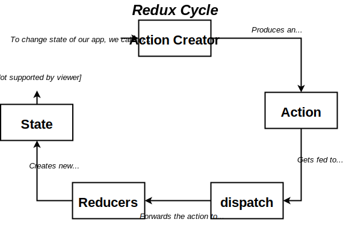


### Action Creators
Action creators are the person dropping the form in our analogy. They are methods that take in some arguments and
return an action.  Actions are the ONLY way we can change the state in our redux store (i.e. `dispatch`ing actions).

An action is just a JS Object that follows a very particular structure.  It has a `type` that represents the
type of action it is (e.g. `CREATE_CLAIM`), and a `payload`, that contains all the extra information that
the action requires.

```jsx harmony
// ACTION CREATOR: People dropping off a form
// One action creator for each type of action in our app
const createPolicy = (name, amount) => {
  return {//Action (a from in our analogy)
    type: 'CREATE_POLICY',
    payload: {
      name: name,
      amount: amount
    }
  };
};
```

### Reducers
Reducers map to departments in our analogy.  Each reducer: 
- Receives all possible actions on the app and is in charge of listening to the actions of interest and creating a NEW
slice of state given the old **slice**of state and the nature of the action.
    - Note that the reducer receives its old SLICE of state, NOT the complete store.
    - DO NOT mutate the old slice of state, create a NEW slice of state. See [these patterns.](#patterns-for-safely-manipulating-state-in-reducers-without-mutation) 
    - Must return ANY value besides `undefined` (`null` is ok).
    - A reducer must be a PURE FUNCTION. It must NOT reach "out of itself" to decide what to return. 
        - e.g. NOT network requests, NOT DOM traversing, NOT read from hard-drive.
- If the action is of no interest to the reducer, it needs to return the slice of old state unchanged.
- It needs to initialize the slice of state it manipulates with a reasonable value (e.g. an empty array).

```jsx harmony
// REDUCERS - Depatments in our analogy
// One reducer per department
// Always takes 2 args: 
//   1. The existing piece of state for that reducer
//   2. An action (generated by an action creator) (a form in our analogy)
const claimsHistory = (oldListOfClaims = [], action) => {
  // In the first call, oldListOfClaims = undefined 
  // oldListOfClaims = [] makes sure to initialize it to an empty array
  
  if (action.type === 'CREATE_CLAIM') {
    // This reducer cares about this action
    // ES6 syntax to create a NEW array out of the old list and append the new one
    // In reducers we always want to return a NEW data structure, NOT mutate the old one
    return [...oldListClaims, action.payload]; 
  }
  
  // Reducer does not care about the action, do nothing
  return oldListOfClaims;
};

// const accounting = ...
```

#### Patterns for safely manipulating state in reducers without mutation
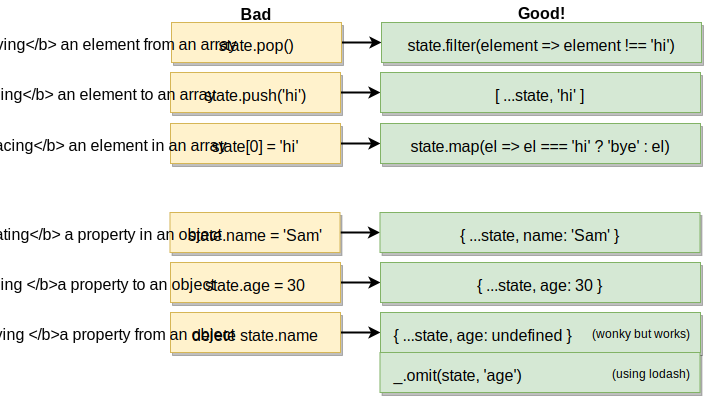

### Pattern: using a central place to define action types
A very common bug that is hard to trace is making a typo in the action `type` between the action creators and the
reducers.  To fix this, we can use a dedicated file `actions/types.js` to centrally declare all action types and use
these in both action creators and reducers.

```jsx harmony
// ./src/actions/types
export const SIGN_IN = 'SIGN_IN';
export const SIGN_OUT = 'SIGN_OUT';

// ./src/actions/index.js
import {SIGN_IN, SIGN_OUT} from './types';

export const signIn = () => {
  return {
      type: SIGN_IN
  };
};
// ...

// ./src/reducers/authReducer.js
import {SIGN_IN, SIGN_OUT} from '../actions/types';

const INITIAL_STATE = { isSignedIn: null };

export default (signInState = INITIAL_STATE, action) => {
    switch (action.type) {
        case SIGN_IN:
            return {...signInState, isSignedIn: true};
        case SIGN_OUT:
            return {...signInState, isSignedIn: false};
        default:
            return signInState;
    }
};
``` 

### Creating and interacting with the Redux Store
The REDUX STORE is a a data store that holds a collection of `reducers` that define how the store reacts
to `actions` created by `action creators`.

- The ONLY way to modify the data in the store is through the `dispatch` function (which in turn holds the `reducers`)
we have defined. 
    - We will NEVER write code like `store.state = {...}`

```jsx harmony
// From Redux, take createStore and combineReducers
import Redux from 'redux';
const { createStore, combineReducers } = Redux;

// Outline the collection of reducers that the store will need
// The name of the keys determine the name of the key in the store, the value is the reducer function
const ourDepartments = combineReducers({
  accounting: accounting,
  claimsHistory: claimsHistory,
  policies: policies
});

// Initialize the store using the combined reducers
const store = createStore(ourDepartments);


// Using the store
const myAction = createPolicy('Alex', 20);
store.dispatch(myAction); // Passes the action to all reducers
console.log(store.getState()); 
// => {accounting: 120, claimsHistory: [], policies: ['Alex']}
```

## Making Redux work with React
### Why do we need `react-redux`?
We need the `react-redux` library to get both working together. Remember that Redux was no specifically designed
for React. Install it by doing `npm install --save react-redux`

- In general when using React with Redux, we will no longer require to store state within the components, since 
the state is now stored within the Redux store.
    - There are some use cases when we can need both Redux State and Component State. TODO: More on this later.

### `Provider` and `Connect` components: the glue between React and Redux

The `react-redux` library provides 2 "glue" components to help React and Redux interact.


__`Provider`__
- Holds the redux store, that in turn is created using the combined reducers.
- Is the top level component of the app. See [Wiring up the provider](#wiring-up-the-provider)

__`Connect`__
- Every time we need a component to communicate with the Redux Store (through the Provider),
    we need to wrap it in a `Connect` component.
- The connect component also provides the action creators to the wrapped components.

### React with Redux Project Structure
A React + Redux project typically has this structure
- `/src`
    - `/actions`: Contains all files related to action creators.  Typically contains a main
    `index.js` file which is used as the import in other files.
    - `/components`: All component-related files.
    - `/reducers`: Reducer-related files. Also tend to include an `index.js` file.
    - `index.js`: Sets up BOTH the react and redux sides of the app.

### Named exports
Allows us to export multiple functions from a single file.
```jsx harmony
// Named Export - src/actions/index.js - We export 2 functions
export const selectSong = song => {
    return {
        type: 'SONG_SELECTED',
        payload: song
    };
};

export const someOtherActionCreator = () => {
    // ...
};
```
```jsx harmony
// Importing a named export - some_other_file.js
import { selectSong } from '../actions';
```

### Wiring up the Provider
1. Combine reducers using the `combineReducers` method from redux.
```jsx harmony
// ./reducers/index.js
import { combineReducers } from 'redux';

export const songsReducer = () => {
    // ...
};

export const selectedSong = (selectedSong=null, action) => {
 // ...
};

export default combineReducers({
    songs: songsReducer,
    selectedSong: selectedSong
});
```
2. Wrap the top level App component with a `Provider` component and pass in a __redux store__ created from
the combined reducers.
```jsx harmony
import React from 'react';
import ReactDOM from 'react-dom';
import { Provider } from 'react-redux';
import { createStore } from 'redux';

import App from './components/App';
import reducers from './reducers';

ReactDOM.render(
    <Provider store={createStore(reducers)}>
        <App/>
    </Provider>,
    document.querySelector('#root')
);
```

### Wiring up Connect
`Connect` needs to be wired up for every component that is dependent on some piece of state inside the
Redux Store OR that needs to trigger some action that updates the redux state (using action creators).

Note that components that have been wired up with `Connect` will be automatically re-rendered when the global
store changes.

There are 2 scenarios: __Class bases components__ and __Functional Components__.

__Class Based Components__

There are 2 key things to wire up:
1. How our component receives information from the global redux state: see `mapStateToProps` below.
2. The __action creators__ that our component will use to update the global store: see 2nd argument of `connect` below.

```jsx harmony
import React from 'react';
import { connect } from 'react-redux';
import {selectSong} from "../actions";

class SongList extends React.Component {
    // Helper method to render list
    renderList(){
        const songs = this.props.songs;
        const renderedSongs = songs.map( song => {
            return (
                <div className='item' key={song.title}>
                    <div className="right floated content">
                        <button className="ui button primary"
                                // This is the "wrapped" action creator function mentioned below
                                onClick={() => this.props.selectSong(song)}>
                            Select
                        </button>
                    </div>
                    <div className="content">{`${song.title} - ${song.duration}`}</div>
                </div>
            );
        });
        return renderedSongs
    }

    render() {
        return <div className='ui divided list'>{this.renderList()}</div>;
    }
}

// MAIN WIRING

// This is how we configure that we want to get this connect component to be notified of changes
// on a particular piece of state from the whole redux store.
// By convention we call this function `mapStateToProps`
const mapStateToProps = (state, ownProps) => {
    // This object is going to be mapped to the props inside the SongList.
    // i.e. Inside Songlist this.props === { songs: state.songs }
    return { songs: state.songs };
};

// `connect` takes 2 args:
// 1) The mapStateToProps function
// 2) An object with action creators (e.g. { selectSong:  selectSong }, abbreviated using ES6 syntax)
//    `connect` wraps all action creators in the `dispatch` function and maps this "wrapped" functions inside the
//     props. That is why we can call `this.props.selectSong()` directly without having to use `dispatch`
export default connect(mapStateToProps, {selectSong})(SongList);
``` 

__Functional Components__

Simpler than class-based.  We only need to `mapStateToProps` and use the `connect` function.
```jsx harmony
import React from 'react';
import { connect } from 'react-redux';

const SongDetail = (props) => {
        return (
            <div>
                <div>{props.song.title}</div>
                <div>{props.song.duration}</div>
            </div>
        );
};

const mapStateToProps = state => {
  return {song: state.selectedSong};
};

export default connect(mapStateToProps)(SongDetail);
```

### Doing pre-calculations inside `mapStateToProps`
In some cases, we need to do some bits of pre-calculation logic to map the redux global state into the 
props a particular component cares about.  `mapStateToProps` is a great place to do that pre-calculation and only
pass to the component the minimum data it needs.

The following example illustrates how we extract the particular `user` a component instance cares about form 
an array of users.
```jsx harmony
import React from 'react';
import {connect} from 'react-redux';
//...

class UserHeader extends React.Component {
    // ...
    render(){
        // ...
        return <div>{user.name}</div>
    }
}

// mapStateToProps gets called with 2 args: 
// 1) The complete redux store, 
// 2) The props that have been injected to the particular instance of the component (e.g. <UserHeader userId=2/> )
// With those 2 pieces of information, we can do any pre-calculation needed to give the component just the right
// data from the redux store.
const mapStateToProps = (state, ownProps) => {
    const user = state.users.find( user => user.id === ownProps.userId);
    return { user: user };
};
export default connect(mapStateToProps, {fetchUser})(UserHeader);
```

### Debugging Redux with the Redux Dev Tools

Redux Dev Tools is a Chrome / Firefox extension that is very helpful for debugging Redux applications.

1. Install the Chrome / Firefox add-on named "Redux Dev Tools" through the extension marketplace.
2. The dev tools require some wiring up on the code. Many sites like Airbnb leave the dev tools hooked in production.
There is no problem on doing that and anybody with the devtools can use the tool on the site.
```jsx harmony
// ...
import { createStore, applyMiddleware, compose } from "redux";
// ...

const composeEnhancers = window.__REDUX_DEVTOOLS_EXTENSION_COMPOSE__ || compose;
const store = createStore(
    reducers,
    composeEnhancers(applyMiddleware())
);

ReactDOM.render(
    <Provider store={store}>
        <App/>
    </Provider>,
    document.querySelector('#root')
);
```

Two key features of the devtools are:
- The left panel of the devtools show a timeline of all the actions that have taken place. We can use "jump" to travel
in time and revert the store to any of the moments. This will also change the app.
- With `debug_session` (e.g. `http://localhost:3000/?debug_session=my_sesh`) we can persist the redux store across
full browser reloads and store the session under a name that we can retrieve later (e.g. `my_sesh` in this example).
    - We can have as many debug sessions stored as we want.
    - To not use andy debug session, just ommit the `?debug_session=...` param in the URL.

## Making API with Redux and Redux-Thunk
### What is a Redux Middleware
Redux Middlewares are functions that slightly change the behaviour of a Redux Store, adding new capabilities to it.
The play a role in the Redux cycle.

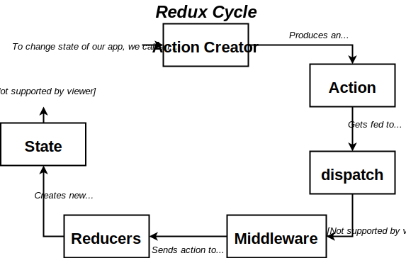

- A middleware is a plain js function that gets called with every action that you `dispatch`.
- The middleware function has the ability to STOP, MODIFY or mess around with the action (e.g. print it to console).
- There are many open-source middlewares.
- Most popular middlewares are for dealing with async actions (like `redux-thunk`).

### General steps for loading data into a Redux app from an external API


### Common pitfall: making network requests inside action creators
This common pitfall also serves as a motivation for `redux-thunk`.

#### Common Invalid code 1
You may feel tempted to make the API network request on the action creator, but his is invalid 
redux code. The following code is invalid and will lead to the error shown below.
```jsx harmony
// actions/index.js
import jsonPlaceholder from "../apis/jsonPlaceholder";

export const fetchPosts = async () => {
    // This is invalid redux code. NO network requests in action creators.
    const response = await jsonPlaceholder.get('/posts');
    return {
        type: 'FETCH_POSTS',
        payload: response
    };
};
```
`Error: Actions must be plain objects. Use custom middleware for async actions.`

The code is invalid because in redux, action creators MUST return PLAIN JS OBJECT with a type property and an optional payload.
The `async` `await` in `fetchPosts = async() => { await...}` actually returns gets transpiled down into a
 complicated function in ES2015 that, while the network request is being done returns a different thing
 that has nothing to do with our intended plain JS object (to make it obvious, transpile it to ES2015).
 
 #### Common Invalid code 2
 To fix the previous code, you may want to directly do the request without `async` and `await`, like shown next.
 ```jsx harmony
 // actions/index.js
 import jsonPlaceholder from "../apis/jsonPlaceholder";
 
 export const fetchPosts =  () => {
     // Remember, axios (or any network library) returns a PROMISE
     const promise =  jsonPlaceholder.get('/posts');
     return {
         type: 'FETCH_POSTS',
         payload: promise
     };
 };
 ```
You won't see an error in this case, but the code won't work.

The code is invalid because by the time our action object get to a reducer we won't have
fetched the data from the API and the payload is actually a promise (not data).

### Synchronous vs Asynchronous action creators
- Synchronous: a "vanilla" function that returns an action immediately.
- Asynchronous: some action creator that needs time to resolve. NEEDS middleware (not supported by default in Redux). 
All network requests fall into this category.

### What is Redux-thunk
- `redux-thunk` is a GENERAL PURPOSE middleware. It is NOT only for async requests.
- All that `redux-thunk` does is change the rules of what action creators can return. With
`redux-thunk`:
    - Action creators CAN return actions (i.e. play JS objects with a `type` property and optionally a `payload`).
    - OR they can return a function and redux-thunk will call it for us.


### How to wire-up redux-thunk to the store
```jsx harmony
// src/index.js
import React from 'react';
import ReactDOM from 'react-dom';
import {Provider} from 'react-redux';
import {createStore, applyMiddleware} from 'redux';
import thunk from "redux-thunk";

import App from './components/App';
import reducers from './reducers';

const store = createStore(reducers, applyMiddleware(thunk));

ReactDOM.render(
    <Provider store={store}>
        <App/>
    </Provider>,
    document.querySelector('#root')
);
```

### How to create an `action-creator` that makes an API call
```jsx harmony
// actions/index.js
import jsonPlaceholder from "../apis/jsonPlaceholder";

export const fetchPosts =  () => {
    // We are going to return a function so that redux-thunk uses it.
    // This function will get called by redux-thunk with the dispatch and getState functions
    // injected as arguments.
    // We don't care about what the inner function returns, the only thing that we care is that the inner function
    // dispatches an action.
    return async (dispatch, getState) => {
            const response = await jsonPlaceholder.get('/posts');
            dispatch({ type: 'FETCH_POSTS', payload: response});
    };
};
``` 

### Toolkit: Avoiding repeated requests with memoization
Memoization can be used to 'cache' repeated outgoing requests and avoid an API getting called
more than one time for a particular parameter.

This can also be accomplished manually by [calling action creators within action creators](#calling-action-creators-within-action-creators),
but the implications are different.

**Pros**
- Does not repeat requests for users that have already been fetched (no N+1)

**Cons**
- The memoized code is hard to understand.
- If we legitimately wanted to re-fetch a user (for example if his data changed on the server), we cannot do it.

```jsx harmony
export const fetchUser = id => {
    return dispatch => {
        return _fetchUser(id, dispatch);
    };
};
// _fetchUser is a memoized function. It gets memoized for every parameter combination.
// i.e. _fetchUser(1, myDispatch) ! will NOT memoize _fetchUser(2, myDispatch)
const _fetchUser = _.memoize((async (id, dispatch) => {
    const response = await jsonPlaceholder.get(`/users/${id}`);
    dispatch({type: 'FETCH_USER', payload: response.data});
}));
```

### Calling action creators within action creators
An alternative and more standard pattern to [memoization](#toolkit-avoiding-repeated-requests-with-memoization
) for avoiding repeated requests is to call action creators within other action creators.

*Pros*
- Re-use other smaller action creators in case we need to use them stand-alone
- Allow to re-fetch data if data in server changes.

*Cons*
- Can be tricky to understand but it makes sense. Revise [the way redux-thunk works](#what-is-redux-thunk)
while looking at this code and everything should make sense.

In the following example, `fetchPosts` might return many posts from the same user and we want to make sure
we do not fetch the info for a given user more than once. 

```jsx harmony
// This "combo" action creators allow us to do custom logic and control the amount of calls that we do
export const fetchPostsAndUsers = () => {
    return async (dispatch, getState) => {

        // Hard to understand: Whenever we call an action creator within another action creator, we need to manually
        // dispatch the action and let redux-thunk handle the rest. 
        // (i.e. if it is a JS object, it will send them to  the reducers.  If it is a function, it will call it.)
        // In this example `fetchPosts()` returns an inner function. Redux-thunk will call it and that 
        // function in turn will dispatch whatever it needs to dispatch.
        await dispatch(fetchPosts()); 
        // We await for the API call to be completed before continuing, since we need the
        // data from fetchPosts for doing the processing.

        // Do some processing. eg find only the unique user Ids
        const allUserIds = _.map(getState().posts, 'userId');
        const userIds = _.uniq(allUserIds);

        // Call another action creator to fetch users
        // We don't have to use await because we no longer care when the user actually get's fetched.
        userIds.forEach( id => dispatch(fetchUser(id)));
    }
};

export const fetchPosts =  () => {
    return async (dispatch, getState) => {
            const response = await jsonPlaceholder.get('/posts');
            dispatch({ type: 'FETCH_POSTS', payload: response.data });
    };
};

export const fetchUser = (id) => {
    return async (dispatch, getState) => {
        const response = await jsonPlaceholder.get(`/users/${id}`);
        dispatch({type: 'FETCH_USER', payload: response.data});
    };
};
```

### Handling multiple pages with React-Router
#### Installing React-Router

`npm install --save react-router-dom`.
 
Make sure the "-dom" is there.  We NEVER want to install `react-router` by itself. We want a higher
level package:
- `react-router-dom`: for DOM react (even if we use Redux).
- `react-router-native`: for react native.
- `react-router-redux`: Bindings between Redux and React Router. 100% not necessary, and not recommended. Stephen
Grider recommends using  `react-router-dom` even in Redux projects.

#### Overview of how does React-Router-Dom work
We interact with react-router-dom through 4 components given in the library: 
- A `Router` (e.g. `BrowserRouter`): internally keeps track of all your navigation `history` and figures out the `path` of the current URL.
- A `history` object that is held by the router and is in charge of storing and changing the URL. All routers except 
the plain `Router` automatically create their own `history` objects 
(see [types of routers](#types-of-routers) and [programmatic navigation](#programmatic-navigation)).
- `Route`: compares the actual path with the `path` prop to render one of our components.
    - Note that if multiple `Route` components match the URL, all matching components get rendered.
- `Link`: see [navigation](#intentional-navigation-in-react-router).

```jsx harmony
import React from 'react';
import { BrowserRouter, Route, Link } from 'react-router-dom';
import PageOne from './PageOne';
import PageTwo from './PageTwo';

const App = () => {
    return(
        <div>
            <BrowserRouter>
                { /* Browser Router can only take one child, hence the div */}
                <div>
                    <Route path="/" exact component={PageOne}/>
                    <Route path="/pagetwo" component={PageTwo} />
                </div>
            </BrowserRouter>
        </div>
    );
};
export default App;
```
#### Path Matching
- Path matching is based on `currentPath.contains(pathInRoute)` string matching. 
    - e.g. For URL "foo.com/page/5", The current path is "/page/5".  The matching would be `"/page/5".contains("/")  => yes`
- The `exact` property in the `Route` component modifies the matching behaviour to exact matching.

#### Intentional Navigation in react-router
__i.e. when the user clicks a button__

- We DON'T want to do a full page refresh to navigate, since it will trigger a __full reload__ of all the JS.
    - All React/Redux state data gets lost on a full-page reload.
- We make use of the `Link` component provided by 'react-router-dom'.
    - Link still renders an `<a>` but prevents default, changes the URL in the browser and 
    updates the `History` inside the `BrowserRouter`, triggering component re-rendering.
    - `Link` may be used inside any of the [router types](#types-of-routers), but it MUST be used inside a router.
    (i.e. it cannot be used in a component that is not nested inside a router).
```jsx harmony
import React from 'react';
import { BrowserRouter, Route, Link } from 'react-router-dom';

const PageOne = () => {
    return (
        <div>
            PageOne
            <Link to="/pagetwo">Navigate to Page Two</Link>
        </div>
    );
};

const PageTwo = () => {
    return (
        <div>
            PageTwo
            <Link to="/">Navigate to Page One</Link>
        </div>
    );
};

const App = () => {
    return(
        <div>
            <BrowserRouter>
                <div>
                    <Route path="/" exact component={PageOne}/>
                    <Route path="/pagetwo" component={PageTwo} />
                </div>
            </BrowserRouter>
        </div>
    );
};
```
#### Programmatic Navigation
Programmatic navigation is done through the `history` object.  If we change the url in the `history` object,
the app will navigate.

Given that the `history` object is automatically created by the all [types of routers](#types-of-routers), except
the plain `Router`, it can by tricky to get a handle to the `history` object within our code.

##### Approach 1: getting a handle on `history` through the props
Every object that is rendered within a router, automatically gets the `history` object inside the 
 props (`this.props.history`). With that, we just need to do `this.props.history.push('/some/path')` to do programmatic 
 navigation.
 
__Caveats__: when submitting forms, we typically want to navigate the user AFTER the async request has succeeded,
NOT after the user pushes the submit button.  For this reason, we need to use __approach 2__.
```jsx harmony
class StreamCreate extends React.Component {
    // ...
    onSubmit = (formValues) => {
        this.props.createStream(formValues);
        // Navigation after submit: this.props.history.push('/streams');
        // This is a problem because the user async request might fail and we will be navigating the user
        // before the async request resolves. The action creator is a better place to do this.
    };
}
```

##### Approach 2: creating our own `history` object to get an easy handle to it everywhere
We can create our own `history` object and inject it to plain `Router` to emmulate what the `BrowserRouter` component
would do, but getting a handle to `history`.

Creating our own history object:
```jsx harmony
// src/history.js
import { createBrowserHistory } from 'history';
export default createBrowserHistory(); //Auto installed by react-router-dom
```

Using a plain `Router` with our `history` object:
```jsx harmony
// src/components/App.js
import React from 'react';
import { Router, Route } from 'react-router-dom';
import history from "../history";

const App = () => {
    return(
        <div className="ui container">
            {/* Inject our history into a plain router */}
            <Router history={history}>
                <div>
                    <Route path="/streams/new" exact component={StreamCreate}/>
                    <Route path="/streams/edit" exact component={StreamEdit}/>
                    {/* ... */}
                </div>
            </Router>
        </div>
    );
};
```

Getting a handle of our `history` object to navigate programmatically from within an action creator:
```jsx harmony
// src/actions/index.js
import history from "../history";

export const createStream = (formValues) => {
    return async (dispatch, getState) => {
        const userId = getState().auth.userId;
        const response = await streams.post('/streams', {...formValues, userId });
        dispatch({type: CREATE_STREAM, payload: response.data});
        // Programmatic Navigation after the async request has finished and the action has been dispatched
        history.push('/');
    };
};
```

#### Types of router in react-router-dom
There are 3 types of router in react-router-dom. They exist to cater for different configurations of how the backend
server serves the React application bundle.js.  Here is an illustration of the problem:
 
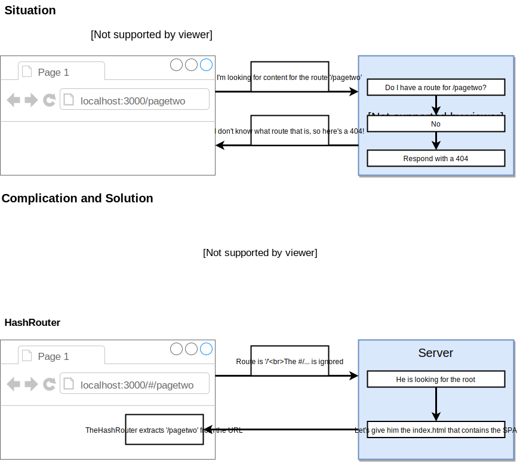

##### Types of routers
- `HashRouter`: the client manages it's URLs by appending a  # `example.com/#/foo`. In this format, the 
full page reloads always point to the root so the backend needs to be configured to return the SPA from the index.
- `MemoryRouter`: keeps state internally and does not modify the URL.  If the user refreshes, the react app goes back to the root.

#### Wildcard URL matching
We can use `react-router` to support urls like `/streams/edit/:id` and pass the information of the wildcard 
(`id` in this case) down to the component as a prop. To do that, we need to wire some things:

Configure the `Route` to support the wildcard parameter: 
```jsx harmony
// src/components/App.js
const App = () => {
    return(
        <div className="ui container">
            <Router history={history}>
                <div>
                    { /* :id indicates a URL param passed using the key id: */}
                    <Route path="/streams/edit/:id" exact component={StreamEdit}/>
                    { /* ... */}
                </div>
            </Router>
        </div>
    );
};
```

Use the wildcard parameter inside the corresponding component (`StreamEdit` in this example).  
- The `Router` automatically passes the `this.props.match` object to all elements rendered by it.
  - `this.props.match.params` contains an object with all the wildcard matches.
-  IMPORTANT: Each component than can be accessed through wildcard matching MUST be designed to work in isolation 
(i.e. it needs to fetch its own data).
  - It cannot assume that the data it needs to function is magically there in the redux store.

```jsx harmony
import React from 'react';
import { connect } from 'react-redux';
import { fetchStream } from "../../actions";

class StreamEdit extends React.Component {
    componentDidMount() {
        // IMPORTANT: components that rely on wildcard navigation must be self-sufficient and
        // fetch the data that they need.  We cannot rely on the data being present on the redux store.
        const urlId = this.props.match.params.id;
        this.props.fetchStream(urlId);
    }

    render(){
        // On the first render, props.streams is undefined because things have not been loaded yet.
        if (!this.props.stream) {
            return <div>Loading...</div>;
        }
        return (<div>{this.props.stream.title}</div>);
    }
}

const mapStateToProps = (state, ownProps) => {
    // The Router in React-Router-Dom injects a match object as props that contains the wildcard matches
    // as params.
    const urlId = ownProps.match.params.id;
    return{
        stream: state.streams[urlId]
    };
};

export default connect(mapStateToProps, {fetchStream})(StreamEdit);
```
Link to routes that have wildcard matching:
```jsx harmony
import { Link } from 'react-router-dom';
// ...
<Link to={`/streams/edit/${stream.id}`}>Edit</Link>
```

#### Wildcard URL matching pitfalls and `Switch`
Vanilla wildcard URL matching can introduce false positive matching.
```jsx harmony
<Route path="/streams/new" exact component={StreamCreate}/>
<Route path="/streams/:id" exact component={StreamShow}/>
{/* ... */}
``` 
In the above example, when the user visits the url `streams/new`, BOTH routes will get matched with `id = new` in the
second one.

To limit the matching of a route to the first match, we use the `Switch` component.
```jsx harmony
import { Router, Route, Switch } from 'react-router-dom';
<Switch>
    {/* ... */}
    <Route path="/streams/new" exact component={StreamCreate}/>
    <Route path="/streams/:id" exact component={StreamShow}/>
    {/* ... */}
</Switch>
```

## Authentication with React using OAuth

### Types of OAuth Authentication
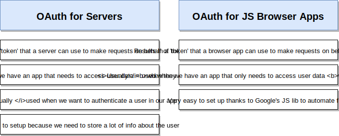

### OAuth for Browser Apps Flow Overview
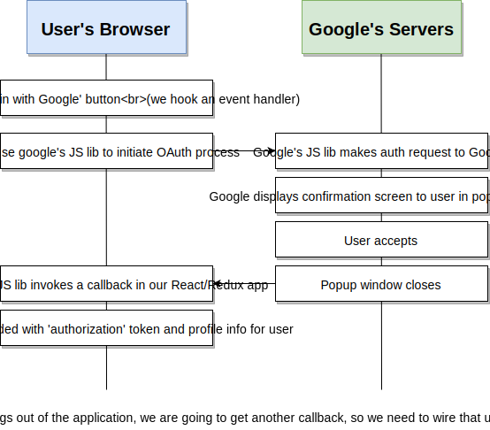


### Configuring Google to use oAuth
The Video _209. Creating OAuth Credentials_ from Udemy has a detailed step by step on how to create the credentials
on the Google developer console.

### Adding Oauth to a vanilla React project
To add the Google OAuth client library, you need to add it in the `<head>` of your HTML.
```html
<head>
  <!-- ...  -->
  <script src="https://apis.google.com/js/api.js"></script>
</head>
```
That loads the google api `gapi` in the window scope of the browser.

#### React side of things

In this example, we create a dedicated `GoogleAuth` component that will handle the authentication logic.

We use `gapi.load` to load the specific part of Google's API library we are interested in (gapi is very big so
developers need to download only the parts needed) and `initialize` the client with our configured credentials.

`gapi.client.init` is an async call that returns a promise, so we can use `then` to put some custom logic
for when the initialization process finishes.

Additionally, we use the provided `auth.isSignedIn.listen` listener to add a callback that updates our state
whenever the sign is status changes.

Finally, we wire 2 `onClick` event handlers for the sign it and sign out buttons.

```jsx harmony
import React from 'react';

class GoogleAuth extends React.Component {
    // When the app first loads we don't know if the user is signed in or not, so we should not assume anything
    state = { isSignedIn: null };

    componentDidMount() {
        // arg 1: What part of the gapi library we want to load
        // arg 2: Callback of what to do once the load has finished
        window.gapi.load('client:auth2', () => {
            window.gapi.client.init({
                // Given when you configure your console.developers.google.com console
                clientId: `${process.env.REACT_APP_GOOGLE_OAUTH_CLIENT_ID}`,
                // What info form the users do we want to get access to.
                scope: 'email'
            }).then(() => {
                // window.gapi.client.init returns a promise. We use `then` to get save a reference to the
                // auth instance in the component's state so that we can easily reference it later.
                // The authInstance contains many convenient methods like
                // - auth.signIn(): opens Google's authentication popup
                // - auth.isSignedIn.get(): true if the user is signed in
                // - auth.isSignedIn.listen(callback): a listener that is called when the isSignedIn status changes
                this.auth = window.gapi.auth2.getAuthInstance();
                this.setState({isSignedIn: this.auth.isSignedIn.get()});
                this.auth.isSignedIn.listen(this.onAuthChange);
            });
        });
    }

    // Needs to be arrow function to bind `this` since it will be used as a callback.
    onAuthChange = () => {
        this.setState({isSignedIn: this.auth.isSignedIn.get()});
    };

    // Callback function for when the user clicks sign in
    onSignInClick = () => {
      this.auth.signIn();
    };

    // Callback function for when the user clicks sign out
    onSignOutClick = () => {
      this.auth.signOut();
    };

    renderAuthButton() {
        if(this.state.isSignedIn === null) {
            return null; // A spinner could also work
        } else if (this.state.isSignedIn) {
            return (
                <button onClick={this.onSignOutClick} className="ui red google button">
                    <i className="google icon" />
                    Sign Out
                </button>
            );
        } else {
            return (
                <button onClick={this.onSignInClick} className="ui red google button">
                    <i className="google icon" />
                    Sign In with Google
                </button>
            );
        }
    }

    render() {
        return (
            <div>{this.renderAuthButton()}</div>
        );
    }
}

export default GoogleAuth;
```

Storing whether a user is signed in or not inside the state of a single component can potentially be a problem if
there are other components that need to know that information.  To fix this [we can use Redux](#adding-oauth-to-a-react-redux-project)
to store that information in the central redux store.

### Adding OAuth to a React-Redux project

- Motivation: We want to store whether a user is sign in or sign out in the redux store to allow any component to know 
if a user is signed in or sign out.
- There are 2 approaches to add OAuth to react-redux projects

#### Approach 1: Centralize Authentication Logic into a component
- (+) All Auth logic is centralized into a single component. Less wiring and good for future reference.
- (-) It does not follow Redux conventions closely. In theory, only action creators should be responsible for changing
the app's state. With this approach, the GoogleAuthComponent is changing the state of our app through
the interaction with `gapi`.
- This is the approach this course uses favoring future reference.
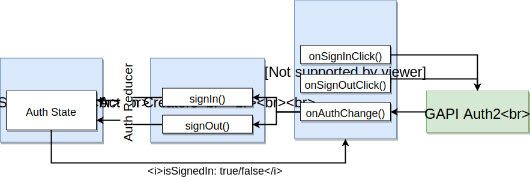

##### The `GoogleAuthComponent`
Compared to the vanilla react approach, the `GoogleAuthComponent` needs some changes:
- The notion of a user being signed in or not needs to be injected from the redux store using `mapStateToProps`.
This entails that `isSignedIn` will no live inside the component's props
- When a user attempts to sign in or sign out, `GoogleAuthComponent` must update the redux store by dispatching
actions using the action creators.

```jsx harmony
import React from 'react';
import { connect } from 'react-redux';
import {signIn, signOut} from "../actions";


class GoogleAuth extends React.Component {

    componentDidMount() {
        // arg 1: What part of the gapi library we want to load
        // arg 2: Callback of what to do once the load has finished
        window.gapi.load('client:auth2', () => {
            window.gapi.client.init({
                // Given when you configure your console.developers.google.com console
                clientId: `${process.env.REACT_APP_GOOGLE_OAUTH_CLIENT_ID}`,
                // What info form the users do we want to get access to.
                scope: 'email'
            }).then(() => {
                // window.gapi.client.init returns a promise. We use `then` to get save a reference to the
                // auth instance in the component's state so that we can easily reference it later.
                // The authInstance contains many convenient methods like
                // - auth.signIn(): opens Google's authentication popup
                // - auth.isSignedIn.get(): true if the user is signed in
                // - auth.isSignedIn.listen(callback): a listener that is called when the isSignedIn status changes.
                //   The callback is called with a boolean that represents if the user is signed in
                this.auth = window.gapi.auth2.getAuthInstance();
                // Use action creators to update the redux store when the library finishes initialization
                this.onAuthChange(this.auth.isSignedIn.get());
                this.auth.isSignedIn.listen(this.onAuthChange);
            });
        });
    }

    // Needs to be arrow function to bind `this` since it will be used as a callback.
    onAuthChange = (isSignedIn) => {
        if (isSignedIn) {
            const userId = this.auth.currentUser.get().getId(); // Provides Google's userID
            this.props.signIn(userId);
        } else {
            this.props.signOut();
        }
    };

    // Callback function for when the user clicks sign in
    onSignInClick = () => {
      this.auth.signIn(); // Use wrapped-with-dispatch action creator
    };

    // Callback function for when the user clicks sign out
    onSignOutClick = () => {
      this.auth.signOut(); // Use wrapped-with-dispatch action creator
    };

    renderAuthButton() {
        if(this.props.isSignedIn === null) {
            return null; // A spinner could also work
        } else if (this.props.isSignedIn) {
            return (
                <button onClick={this.onSignOutClick} className="ui red google button">
                    <i className="google icon" />
                    Sign Out
                </button>
            );
        } else {
            return (
                <button onClick={this.onSignInClick} className="ui red google button">
                    <i className="google icon" />
                    Sign In with Google
                </button>
            );
        }
    }

    render() {
        return (
            <div>{this.renderAuthButton()}</div>
        );
    }
}

const mapStateToProps = (state, ownProps) => {
    return { isSignedIn: state.auth.isSignedIn };
};

export default connect(
    mapStateToProps,
    {signIn, signOut}
)(GoogleAuth);
```

##### `Action Creators`
```jsx harmony
// src/actions/index.js
import {SIGN_IN, SIGN_OUT} from './types';

export const signIn = (userId) => {
  return {
      type: SIGN_IN,
      payload: userId
  };
};

export const signOut = () => {
    return {
        type: SIGN_OUT
    };
};
```
##### `Reducers` 
```jsx harmony
// src/reducers/authReducer
import {SIGN_IN, SIGN_OUT} from '../actions/types';

const INITIAL_STATE = { isSignedIn: null, userId: null };

export default (signInState = INITIAL_STATE, action) => {
    switch (action.type) {
        case SIGN_IN:
            return {...signInState, isSignedIn: true, userId: action.payload};
        case SIGN_OUT:
            return {...signInState, isSignedIn: false, userId: null};
        default:
            return signInState;
    }
};

// src/reducers/index.js
import { combineReducers } from "redux";
import authReducer from "./authReducer";

export default combineReducers({
    auth: authReducer
});
```
 
#### Approach 2: Distribute Authentication logic to follow Redux conventions
- (+) Follows Redux Convention by interacting with `gapi` inside the action creators.
- (-) The auth logic gets distributed among the action creators and the `GoogleAuthComponent`,
 making it harder to trace for future reference.
 - The code for this approach is not given in the course.
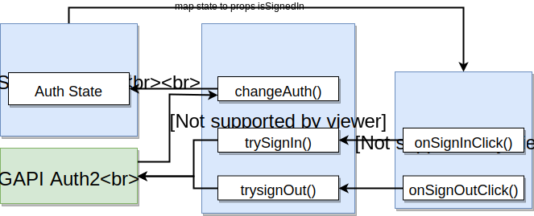

### Redux Form
__The `8_streams/client/src/components/streams/StreamCreate.js` file has a fully annotated example of a form component.__

#### Motivation
Without Redux, we use [class-level state, event handlers and controlled elements](#controlled-vs-uncontrolled-elements) 
to handle forms.

With Redux, we favor the use of the central redux store instead of class-level state. Redux form helps us with this.

#### Overview 


#### Documentation
Redux form documentation is outstanding and available at redux-form.com.  
The main highlights are the examples, here are some that you might find interesting:
- [Synchronous Validation](https://redux-form.com/8.2.2/examples/syncvalidation/): Client-side validation of form
- [Asynchronous Blur Validation](https://redux-form.com/8.2.2/examples/asyncvalidation/) How to run asynchronous server-side onBlur validation on your form when certain fields lose focus.
- [Wizard Form](https://redux-form.com/8.2.2/examples/wizard/) How to create a multi-page "wizard" form.

#### Setting up Redux Form
The only setup we need to do is wire the provided redux-form reducer to our combineReducers.
```jsx harmony
import { combineReducers } from "redux";
import { reducer as formReducer } from 'redux-form';
import authReducer from "./authReducer";

// We have to to assign the redux-form reducer to the 'form' key
export default combineReducers({
    auth: authReducer,
    form: formReducer
});
```
                  
#### Basic building-blocks of a form 
Creating a form with Redux-Form requires 3 things:
1. Wire redux form into the component that contains the form using the `reduxForm` function.
2. Wire up form fields using the `Field` wrapper component (see `Field` and `renderInput` next).
3. Wire how to handle the form submission event using `handleSubmit` to wrap our custom `onSubmit` function.
4. Wire a custom action creator to be used inside our `onSubmit` that will trigger an API request.

```jsx harmony
import React from 'react';
// Field is a react component
// reduxForm is a function
import { Field, reduxForm } from "redux-form";
import { connect } from "react-redux";
import {createStream} from "../../actions";

class StreamCreate extends React.Component {

    // When given to a Field component, redux form will call this function passing formProps.
    // formProps is an object that contains:
    //   1) Information about the the state of the field (the name, the value). Remember, we want controlled elements.
    //   2) A collection of event handlers that internally contain action creators that we need to wire to update
    //      the redux store.
    //   3) Any other custom props that we pass to the Field component that are NOT part of 1 and 2 (e.g. label in this case)
    //   4) A `meta` property that contains a bunch of meta info about the field's state including the `error` we give
    //      on validation
    // formProps.input has the shape of:
    // {name: "title", onBlur: ƒ, onChange: ƒ, onDragStart: ƒ, ..., value: "my title", meta: {error: '', ...}}
    renderInput (formProps) {
        // Under the hood we want to do something like this:
        // return <input  onChange={formProps.input.onChange} value={formProps.input.value }/>;
        // However, the {...formProps.input} syntax is a shorthand to wire everything inside the formProps.input to the
        // input component using the same keys as the ones in the object.
        return (
            <div className="field">
                <label>{formProps.label}</label>
                <input  {...formProps.input} />
            </div>
        );
    }

    // Our custom onSubmit function that will get wrapped by handleSubmit
    // handleSubmit passes the formValues as an argument.
    // e.g. formValues:  {title: "my title", description: "my description"}
    // handleSubmit does NOT call our custom onSubmit function if the form has errors.
    onSubmit = (formValues) => {
        this.props.createStream(formValues);
    };

    render() {
        return (
            // handleSubmit is injected by redux-form and wraps our custom 'onSubmit' function.
            // - It preventsDefault so that we don't need to do it
            // - It gets all the form values and passes them as an argument to our 'onSubmit' function.
            <form className="ui form" onSubmit={this.props.handleSubmit(this.onSubmit)}>

                {/* Field is a wrapper for any type of input that wires up all the redux-form infrastructure required. */}
                {/* Field needs some props: */}
                {/* - name: the name of the property this field is going to manage */}
                {/* - component: a component or a function that actually returns the field to be rendered */}
                {/*   - the function will be called with the formProps argument */}
                <Field name='title' component={this.renderInput} label="Enter Title"/>
                <Field name='description' component={this.renderInput} label="Enter Description"/>
                <button className="ui button primary">Submit</button>
            </form>
        );
    }
}


// reduxForm is a function that serves an similar purpose connect function from react-redux
// but limited to redux-form instrumentation.
//   - It maps the state of the redux store to the props of the component
//   - It injects the necessary action creators
// reduxForm receives a single object to configure it
//   - 'form' can be any string to describe the purpose of the form
// @return The return of reduxForm(...)(StreamCreate) is a component that is our
// component wrapped by reduxForm
const formWrapped = reduxForm({
    form: 'streamCreate'
})(StreamCreate);

// To inject custom state or action creators (not related to redux-form), we
// still need to use connect.
export default connect(null, {createStream})(formWrapped);
```

#### Client-side field validation
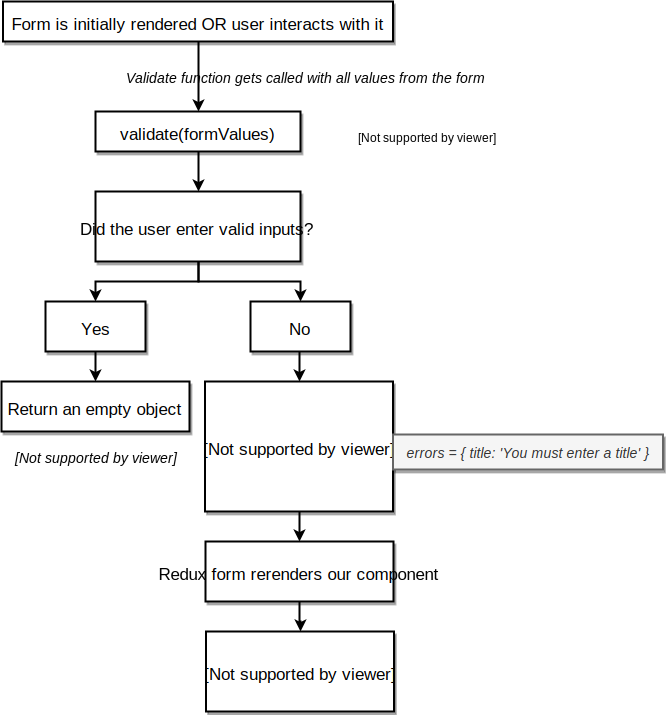

The example shows how to do client-side validation that is rendered only after the field has been touched.

```jsx harmony
import React from 'react';
// Field is a react component
// reduxForm is a function
import { Field, reduxForm } from "redux-form";

class StreamCreate extends React.Component {
    // formProps is an object that contains a `meta` property that contains a bunch of meta info about the field's 
    // state including the `error` we give on validation and whether the field has been touched
    renderInput = (formProps) => {
        const meta = formProps.meta;
        const className = `field ${meta.error && meta.touched ? 'error' : ''}`;
        return (
            <div className={className}>
                <label>{formProps.label}</label>
                <input  {...formProps.input} />
                { this.renderError(meta) }
            </div>
        );
    };
    
    // Helper function to decide when to render errors
     renderError ({error, touched}) {
        if (error && touched) {
            return (
                <div className="ui error message">
                    <div className="header">{error}</div>
                </div>
            );
        }
    };
    
    // handleSubmit does NOT call our custom onSubmit function if the form has errors.
    onSubmit = (formValues) => {
        // ...
    };

    render() {
        return (
            <form className="ui form" onSubmit={this.props.handleSubmit(this.onSubmit)}>
                {/* The errors get injected into the formProps that are passed to the component functions */}
                <Field name='title' component={this.renderInput} label="Enter Title"/>
                <Field name='description' component={this.renderInput} label="Enter Description"/>
                <button className="ui button primary">Submit</button>
            </form>
        );
    }
}

// We define this function OUTSIDE the component and wire it in into the component
// using the `reduxForm` function.
// The function gets called with a `formValues` object that contains the values of each Field using the name as key
// e.g. { title: 'My title', description: 'My description' }
// If the fields are ok, then we must return an empty objects
// Else we must return an object that contains the fields with errors along with a message. The match with the
// Field names is VERY IMPORTANT
const validate = (formValues) => {
    const errors = {};
    if (!formValues.title) {
        errors.title = 'You must enter a title';
    }
    if (!formValues.description) {
        errors.description = 'You must enter a description';
    }
    return errors;
};

export default reduxForm({
    form: 'streamCreate',
    validate: validate
})(StreamCreate);
```

#### Form component re-usability in redux-form
This section shows a pattern for re-using a form component for a very common use case `new` and `edit` forms.  The 
diagram shows the high-level strategy for re-use.
 
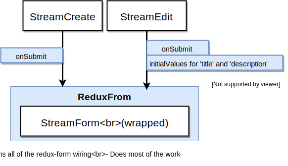

The key points are:
- `onSubmit` is injected as a prop into the wrapped `StreamForm` component.
- The `initialValues` property of any component that has been wrapped by `redux-form` is a special prop that
allows us to set the values of the `form` object in the redux store, which in turns changes the value of the
`Field` components inside the forms.
- Use `StreamForm` within both the `StreamCreate` and the `StreamEdit` components. 

```jsx harmony
// StreamForm
import React from 'react';
import { Field, reduxForm } from "redux-form";


class StreamForm extends React.Component {
    // Redux form automatically changes the formProps with the initialValues prop 
    renderInput = (formProps) => {
        const meta = formProps.meta;
        const className = `field ${meta.error && meta.touched ? 'error' : ''}`;
        return (
            <div className={className}>
                <label>{formProps.label}</label>
                <input {...formProps.input} />
                { this.renderError(meta) }
            </div>
        );
    };

    renderError ({error, touched}) { 
        // ... 
    };

    // onSubmit uses the injected onSubmit prop defined by the parent component.
    onSubmit = (formValues) => { this.props.onSubmit(formValues) };

    render() {
        return (
            // Everything else is the same as any form
            <form className="ui form error" onSubmit={this.props.handleSubmit(this.onSubmit)}>
                <Field name='title' component={this.renderInput} label="Enter Title"/>
                <Field name='description' component={this.renderInput} label="Enter Description"/>
                <button className="ui button primary">Submit</button>
            </form>
        );
    }
}

const validate = (formValues) => {
    // ... 
};

// Returns the wrapped StreamForm
// Note that the 'streamForm' key will be shared inside the redux-store for both new and edit forms
export default reduxForm({
    form: 'streamForm',
    validate: validate
})(StreamForm);
```
```jsx harmony
// Stream Edit
import React from 'react';
import { connect } from 'react-redux';
import { fetchStream, editStream } from "../../actions";
import StreamForm from "./StreamForm";


class StreamEdit extends React.Component {
    componentDidMount() {
        // Load data for this component to work
    }
    
    // Our custom onSubmit function that will get injected into the StreamForm component as a prop 
    onSubmit  = (formValues) => {
      this.props.editStream(this.props.stream.id, formValues);
    };

    render(){
        if (!this.props.stream) {
            return <div>Loading...</div>;
        }
        const {title, description} = this.props.stream;
        return (
            <div>
                <h3>Edit Stream</h3>
                {/* InitialValues is a special redux-form prop to indicate the form values of the StreamForm */}
                {/* Make sure you only pass initial values that have a corresponding Field in the form */}
                <StreamForm initialValues={{title, description}}
                            onSubmit={this.onSubmit}/>
            </div>
        );
    }
}

const mapStateToProps = (state, ownProps) => {
    const urlId = ownProps.match.params.id;
    return {
        stream: state.streams[urlId]
    };
};

export default connect(mapStateToProps, {fetchStream, editStream})(StreamEdit);
```

### React Portals
React portals are a general concept that we will illustrate through the *modal* use case. However, there are other
use cases for this feature.

#### Motivation


- Modals in react will be deeply nested 
- Portal, lets a components render another component NOT as a direct child, but as a child of another element (typically the body)

_Problem_
- StreamDelete needs to render a Modal but it can only do so by nesting it within itself.
- By the time an arbitrary element needs to render a modal, it could be arbitrarily nested, making it impossible to 
style as a modal reliably (because it depends on the styling of all the chain.)

_Solution_
- Portals allow a component to render another component but NOT as a direct child, but as a child of another element.
  - This other element is typically the `body`, but it doesn't have to be the body.
 - Typical Portal use cases: modals, use react to render content into an element that was not created by your react app
 (e.g. a 3rd party element or a server-rendered html element.).

#### Basic Portal Code
Create a target html element for the portal:
```html
<body>
    <div id="root"></div>
    <!--  This will be used as the modal portal target, everything inside will be replaced  -->
    <div id="modal"></div>
  </body>
```

Create the portal component:
```jsx harmony
import React from 'react';
import ReactDOM from 'react-dom';

const Modal = props => {
    // When we create a portal, we return whatever ReactDOM.createPortal returns.
    // The function takes 2 args:
    //   1) The jsx we want to render
    //   2) The element we want to render (1) into. Note that everything inside will be replaced
    // Note the classNames are specific to semantic ui
    return ReactDOM.createPortal(
        <div onClick={props.onDismiss} className="ui dimmer modals visible active">
            { /* MODAL SPECIFIC COMMENT: */ }            
            { /* The default behaviour of HTML events is to propagate up the elements until */ }
            { /* some element handles it.  Here we want to stopPropagation to avoid navigating */ }
            { /* the user when he clicks inside the modal box */ }
            <div onClick={(e) => e.stopPropagation()} className="ui standard modal visible active">
                <div className="header">{props.title}</div>
                <div className="content">{props.content}</div>
                <div className="actions">{props.actions}</div>
            </div>
        </div>,
        document.querySelector('#modal')
    );
};

export default Modal;
```

Render the portal from other component:
```jsx harmony
import React from 'react';
import Modal from "../Modal";
import history from "../../history";

const StreamDelete = () => {
    const actions = (
        <div>
            <button className="ui button negative">Delete</button>
            <button className="ui button">Cancel</button>
        </div>
    );

    return (
        <div>
            StreamDelete
            <Modal
                title="Delete Stream"
                content="Are you sure you want to delete this stream?"
                actions={actions}
                onDismiss={()=> history.push('/')}
            />
        </div>
    );
};

export default StreamDelete;
```
## React Fragments
By default, to return sibling elements in JSX we are forced to wrap them with a "dummy div" so that we only return one
element.

This wrapping may be unacceptable in some circumstances. For example, it might throw-off the styling of a CSS 
framework that expects a specific structure.

`React.Fragment`s allow us to use "an invisible wrapper" that does not get rendered in the DOM.

```jsx harmony
const actions = (
        <React.Fragment>
            <button className="ui button negative">Delete</button>
            <button className="ui button">Cancel</button>
        </React.Fragment>
    );
```  

## React Context
Note: the app `9_translate_context` contains the code samples for this section.

###  Motivation
- *The Props System:* communicate from parent to DIRECT child.
- *The Context System:* Pass data from a PARENT component to ANY NESTED child component. 
    - Not necessarily the direct children.
    - It is just about data communication, just like props so it is not full replacement of Redux.
    - Sometimes we just want to communicate something from the parent to a deeply nested
    child and the components in the middle don't really care about the communication.
    - Using only props, we end up using the intermediate components just to push down data, even if they don't care.


### How does the Context System work?
The context system works as a pipeline that pushed data down from parents to children.

#### Create a dedicated context object
The first thing we want to do when working with context is to create dedicated context objects that we import inside
other files only when needed. We do so by creating a `contexts` folder and creating a `someContext.js` file per
context we are interested in.

Each context object represents a pipeline of data that is passed down from the parents to all children.

```jsx harmony
// src/contexts/LanguageContext.js
import React from 'react';
export default React.createContext();
```

#### How to get information IN and OUT of the context object in the pipeline


##### There are 2 ways to get data IN.
###### Way 1. By setting a default value 
 - This is barely usable, way 2 makes much more sense.   
```jsx harmony
// src/contexts/LanguageContext.js
import React from 'react';
// createContext takes a default value.  It can be anything (e.g. an object, an array, etc...)
export default React.createContext('english');
```

###### Way 2. By using a `Provider` component withing the parent component.
- Allows us to modify the default value.
- `Provider` is a component that allows us to signal the scope of a particular INSTANCE of a context object.
  - Every time we use the `<LangContext.Provider value={...}>...</LangContext.Provider>` a new instance of 
  `LangContext` is created and used only within the scope of whatever is nested. 
  - NOT the same `provider` than the one from `react-redux`.
```jsx harmony
import React from 'react';
import UserCreate from "./UserCreate";
import LanguageContext from "../contexts/LanguageContext";

class App extends React.Component {
    state = { language: 'english' };

    onLanguageChange = (newLanguage) => {
        this.setState({language: newLanguage});
    };

    render() {
        return (
            <div className="ui container">
                <div>
                    Select a Language:&nbsp;
                    <i className="flag us" onClick={() => this.onLanguageChange('english') }/>
                    <i className="flag nl" onClick={() =>  this.onLanguageChange('dutch') } />
                </div>
                {/* - With the LanguageContext.Provider component we create an instance of the LangContext */}
                {/*   - That instance is scoped to the all children nested within */}
                {/* - With the value property, we can modify the value of the context. We can use anything for the value. */}
                <LanguageContext.Provider value={this.state.language} >
                    <UserCreate/>
                </LanguageContext.Provider>

                {/* This is ANOTHER INSTANCE of LanguageContext that is completely independent from the one above */}
                <LanguageContext.Provider value={'english'} >
                    <UserCreate/>
                </LanguageContext.Provider>
            </div>
        );
    }
}

export default App;
```


##### There are 2 ways to get data OUT

###### Way 1: By using `this.context`
```jsx harmony
import React from 'react';
import LanguageContext from "../contexts/LanguageContext";

class Button extends React.Component {
    // Connect the Language Context to the Component
    // contextType is a special property for React.
    static contextType = LanguageContext;

    render() {
        // this.context is used to get the data in the contexts
        const text = this.context === 'english' ? 'Submit' : 'Voorleggen';
        return(
            <button className="ui button primary">{text}</button>
        );
    }
}

export default Button;
```

###### Way 2: By creating a `Consumer` component
- The `Consumer` component is automatically created within the `context` object.
- We use the `Consumer` whenever we want to use the value inside the context.

```jsx harmony
import React from 'react';
import LanguageContext from "../contexts/LanguageContext";

class Button extends React.Component {
    render() {
        return(
            <button className="ui button primary">
                <LanguageContext.Consumer>
                    {/* We always need to provide a function as a child to the Consumer */}
                    {/* The function is called with the context value as an argument and we */}
                    {/* can put any logic we want within the function (including returning other components) */}
                    {(value) => value === 'english' ? 'Submit' : 'Voorleggen'}
                </LanguageContext.Consumer>
            </button>
        );
    }
}
export default Button;
```

###### When to use a `Consumer` instead of `this.context`
- We need to use `Consumer` when we need to access data out of MULTIPLE context objects within a single component.
    - The `this.context` approach only allows for one context per object to be used.

```jsx harmony
import React from 'react';
import LanguageContext from "../contexts/LanguageContext";
import ColorContext from "../contexts/ColorContext";

class Button extends React.Component {

    renderButton(color){
        return(
            <button className={`ui button ${color}`}>
                <LanguageContext.Consumer>
                    {(value) => value === 'english' ? 'Submit' : 'Voorleggen'}
                </LanguageContext.Consumer>
            </button>
        );
    }

    render() {
        return(
            // To read from multiple contexts we nest Consumer components.
            // The same rule of having a consumer return a function applies.
            // In this case we use a helper function to organize the code
            <ColorContext.Consumer>
                { (color) => this.renderButton(color) }
            </ColorContext.Consumer>
        );
    }
}

export default Button;
``` 

```jsx harmony
import React from 'react';
import UserCreate from "./UserCreate";
import LanguageContext from "../contexts/LanguageContext";
import ColorContext from "../contexts/ColorContext";

class App extends React.Component {
    state = { language: 'english', color: 'red' };
    //...
    render() {
        return (
            <div className="ui container">
                {/* To pass in multiple contexts, we just nest providers. */}
                {/* Order does not matter in this case */}
                <LanguageContext.Provider value={this.state.language} >
                    <ColorContext.Provider value={this.state.color}>
                        <UserCreate/>
                    </ColorContext.Provider>
                </LanguageContext.Provider>
            </div>
        );
    }
}

export default App;
```
###  Does Context replace Redux?
Not really, vanilla Context only provides ONE of the many other things that redux provides.
 - Redux 
  - Features: 
    - Distributes data to various components
    - Centralizes data in a store
    - Provides a mechanism for changing data in the store
  - Pros: 
      - Excellent documentation
      - Well-known design patterns
      - Tremendous amount of open source libraries
- Context:
  - Features:
    - Distribute data to various components
  - Pros:
    - No extra libraries
  - Cons:
    - Hard to build 'store' components that need to reach into other 'store' components 
- Stephen Grider does NOT personally recommend replacing `redux` with context.
 
If you want to know how to replace `redux` with `Context`, watch the "Replacing Redux with Context" section in
Udemy. 
   - There is a fair amount of work involved in doing this properly. 

----------------------------------------------------------------
Note: to edit any of the diagrams go to
`https://www.draw.io/#Hserodriguez68%2Freact-cheatsheet-udemy-2019%2Fmaster%2Fdiagrams%2F{name of diagram}.svg`
