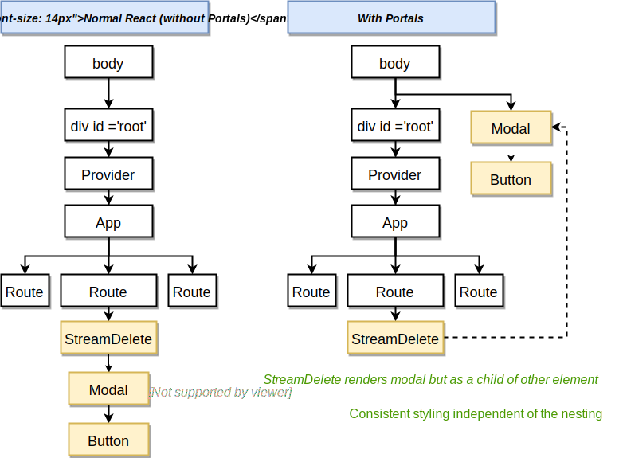

### React Portals
React portals are a general concept that we will illustrate through the *modal* use case. However, there are other
use cases for this feature.

#### Motivation


- Modals in react will be deeply nested 
- Portal, lets a components render another component NOT as a direct child, but as a child of another element (typically the body)

_Problem_
- StreamDelete needs to render a Modal but it can only do so by nesting it within itself.
- By the time an arbitrary element needs to render a modal, it could be arbitrarily nested, making it impossible to 
style as a modal reliably (because it depends on the styling of all the chain.)

_Solution_
- Portals allow a component to render another component but NOT as a direct child, but as a child of another element.
  - This other element is typically the `body`, but it doesn't have to be the body.
 - Typical Portal use cases: modals, use react to render content into an element that was not created by your react app
 (e.g. a 3rd party element or a server-rendered html element.).

#### Basic Portal Code
Create a target html element for the portal:
```html
<body>
    <div id="root"></div>
    <!--  This will be used as the modal portal target, everything inside will be replaced  -->
    <div id="modal"></div>
  </body>
```

Create the portal component:
```jsx harmony
import React from 'react';
import ReactDOM from 'react-dom';

const Modal = props => {
    // When we create a portal, we return whatever ReactDOM.createPortal returns.
    // The function takes 2 args:
    //   1) The jsx we want to render
    //   2) The element we want to render (1) into. Note that everything inside will be replaced
    // Note the classNames are specific to semantic ui
    return ReactDOM.createPortal(
        <div onClick={props.onDismiss} className="ui dimmer modals visible active">
            { /* MODAL SPECIFIC COMMENT: */ }            
            { /* The default behaviour of HTML events is to propagate up the elements until */ }
            { /* some element handles it.  Here we want to stopPropagation to avoid navigating */ }
            { /* the user when he clicks inside the modal box */ }
            <div onClick={(e) => e.stopPropagation()} className="ui standard modal visible active">
                <div className="header">{props.title}</div>
                <div className="content">{props.content}</div>
                <div className="actions">{props.actions}</div>
            </div>
        </div>,
        document.querySelector('#modal')
    );
};

export default Modal;
```

Render the portal from other component:
```jsx harmony
import React from 'react';
import Modal from "../Modal";
import history from "../../history";

const StreamDelete = () => {
    const actions = (
        <div>
            <button className="ui button negative">Delete</button>
            <button className="ui button">Cancel</button>
        </div>
    );

    return (
        <div>
            StreamDelete
            <Modal
                title="Delete Stream"
                content="Are you sure you want to delete this stream?"
                actions={actions}
                onDismiss={()=> history.push('/')}
            />
        </div>
    );
};

export default StreamDelete;
```
